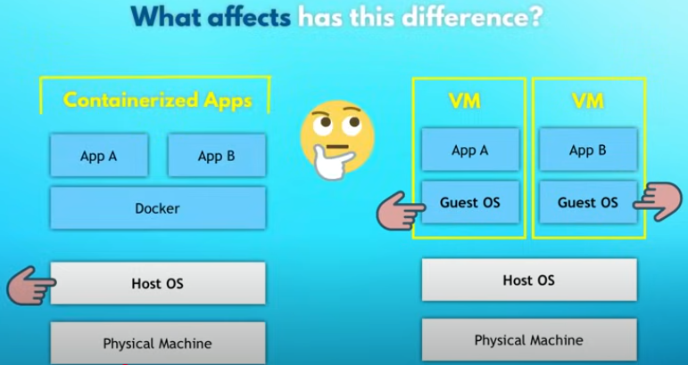

- What and why docker
- Docker vs Virtual Machines
- Install Docker locally
- Images vs Containers
- Public vs Private registries
- Run containers
- Create own images (Dockerfile)
- Main Docker commands
- Image versioning

## What is docker
- a virtualization software which makes developing and deploying applications much easier.
- Packages application with all the necessary dependencies, configuration, system rools and runtime into a container.
- Application and runtime both are packaged and can be easily distributed.

## Why this is a big deal?

### Development process before containers
- devs needed to install and configure all services directly on their OS on their local machine.
- For example, postgres for database, redis for cache, mosquito for messaging, etc..
- Depending on the OS they are using, the installation process will be different.
- There are multiple steps of installation and configuration of the service.
- Chances of error happening is very high and the process is tedious.

### Development process with containers
- With containers, we don't have to install any of the services directly on the OS.
- All services are packaged in 1 isolated environment.
- Postgres packaged with all dependencies and configs
- Start services as a docker container using 1 docker command, which fetches the docker container from the internet and starts it from your computer.
- It will be the same regardless of OS and services we are using.
```
docker run postgres
docker run redis
docker run ...
```
- We can focus and work more on development instead of trying to install and configure services on the machine.
- Standardizes the process of running any service on any local dev environment.
- We can have different versions of same applications running on local environment without having any conflict.(difficult without docker).

### Deployment process without containers
- Development team writes the code and documents how to install the required dependencies.
- The operation teams does that and configure the server.
- developers might forget to mention some steps. (Communication overhead)

### Deployment process with containers
- developers create an application package that doesn't only include the code itself but also the dependencies and the configuration of the application.
- Instead of textual, everything is packaged inside the docker artifact.
- Since everything is captured in one environment, the operation people don't have to configure any of the stuff for server.
- Less room for errors.
- Operation team : Run a docker command to fetch and run the docker artifacts. 
- In the same way, the opns team runs the services the application needs as a docker container. Makes the deployment process way easier.
- They have to install docker runtime on the server.

## Virtual Machine vs Docker.
- Docker and Virtual Machine are both virtualization tools.
- Docker virualizes the application layer and some other applications installed on top of that application layer.(python runtime)
- It uses the kernel of the host.
- Virtual machine virtualizes application layer and kernel. It doesn't use hosts kernel but actually boots up its own.
- 
- Docker images are much smaller as they have to apply only 1 layer of operating system.
- docker is only of MB while virtual machine has some GB.
- Docker is much faster than VM as VM has to boot up a kernel everytime it starts and docker container just reuses the host kernel.
- VM is compatible with all OS. But docker is compatible only with linux distros.
- Docker desktop can be used to run linux based containers on windows/mac OS.
- Docker desktop uses a hypervisor layer with a light weight linux distro